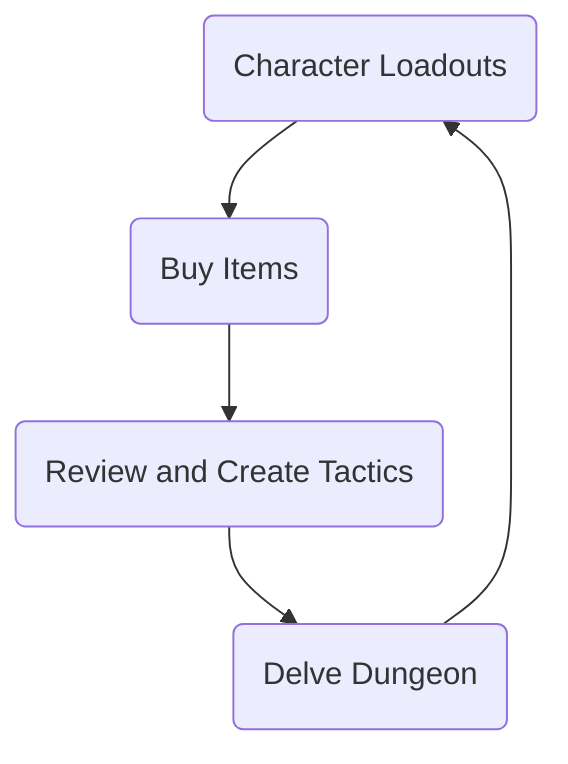

---  
created: 2024-05-24 19:51  
modified: 2024-05-24T21:08:53-05:00  
slug: index  
publish-hour-heroes: true  
title: Hour Heroes Game Design Document  
---  
This is the game design document for Hour Heroes. Possibly will become documentation for it in general.  
  
The **project goals** for this game is to not only make a game, but to lay the foundation of some core game systems that I can use to reuse in **Faemon**.  
  
## Resources  
- [Godot 4.2.2](https://godotengine.org/)  
	- with the [Notification Scheduler Plugin](https://github.com/cengiz-pz/godot-android-notification-scheduler-plugin) by [cengiz-pz](https://github.com/cengiz-pz) for android phone support.  
  
## Inspirations  
I want to make this game a spiritual successor to the Logging Quest series, of which there were two entries on android.[^1]  
  
While a great game, there are a number of issues that I feel hold the game back a bit.  
  
1. Outdated to the point that it doesn't properly schedule notifications  
2. UI is very old, with many windows using the old android UI such as buttons and lists.  
3. Android only, with no windows or browser versions.  
4. The gameplay, while intentionally limited, leaves the user to be unable to do literally anything while waiting for the party to return (such as buying items)  
5. Very very bare presentation, with no fun lore to speak of (as far as I can tell)  
  
I would like to try to address these issues as followed:  
1. Updated to use modern Android notifications thanks to the Notification Scheduler Plugin  
2. More modern UI, using Godot as the engine of choice  
3. Cross-platform support for Web, Windows, and Android, with Android as the main focus.  
4. Improved gameplay, allowing the player to at the very least buy and sell items while the party delves the dungeon.   
5. Improved presentation with lore items and enemy descriptions.  
  

  
  
  
  
  
  
[^1]: You can find the Logging Quest 2 wiki [here](https://logging-quest-2.fandom.com/wiki/Logging_Quest_2_Wiki)